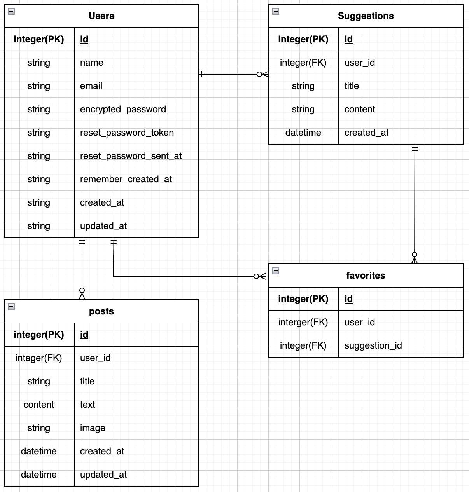

## サービス概要
休日家族で何をするか提案してくれるサービス
条件（家族構成、天気、予算等）に合わせて候補を３件提示
提案してくれるから考える手間が減る

## このサービスへの思い・作りたい理由
毎回子供の休日何をするのか当日になっても決まらないことが多い
このサービスをもと考える負担を軽減したい、家庭内でも積極的に考えてますアピールができる
自分自身、子供２児の父であり、 日々考えることが多くなってしまう時があり、子供の遊びは後回しにしがちになってしまう。 そんな時に誰かが行き先を決めてくれると楽だと感じたことがこのアプリを作ろうと思ったきっかけです。

## ユーザー層について
子供と時間を過ごす大人
→そもそも計画を立てるのが苦手、日々忙しくて時間が取れない、満足度の遊びを考えたい人　

## サービスの利用イメージ
条件を入力して子供との休日何をするか候補を提案してくれることで、
考える負担を軽減し、子供やパートナーに提案する頼れる存在になる

## ユーザーの獲得について
身近な人（友人、職場の同僚など）に直接使ってもらうよう伝える  
今後、SEO、SNSを活用することについては要検討

## サービスの差別化ポイント・推しポイント 似たようなサービスが存在する場合、そのサービスとの明確な差別化ポイントとその差別化ポイントのどこが優れているのか教えてください。 
検索サービス（いこーよ、Holiday、あそビュー！、その他イベントサイトがある） 上記は主に検索・予約に特化したサービスなので、 提案型×パーソナライズ×家族向けで差別化を図りたい 日記、お気に入り機能を追加し、Chat-GPTに付加価値をつける
| 項目         | 卒業制作アプリ      | いこーよ            | Holiday           | あそビュー！         |
|--------------|---------------------|---------------------|-------------------|---------------------|
| メインユーザー | 家族・子育て世帯     | 家族・子育て世帯     | 旅行好き          | 全世帯              |
| 提案機能     | 有（chat-GPT）      | 有（条件検索型）     | 有（条件検索型）   | 有（条件検索型）     |
| ユーザー参加機能 | 導入検討            | 口コミ・レビュー     | 口コミ・レビュー   | 口コミ・レビュー     |
| 予約機能     | なし                | 有                  | 有                | 有                  |
| 日記機能     | 有                  | なし                | 有                | なし                |

## 機能候補
### 方向性 
1.まずは自分が使いやすいものにする(候補を表示するという最低限の機能) 
2.身近な人に使ってもらって機能を拡充する（日記機能など） 
3.反響次第でサービスを広げるか検討 
### MVPリリース時に作っていたいもの 
1.ユーザー登録機能
2.ログイン機能
3.Chat-gptによる提案機能 
4.お気に入り機能
5.お気に入り解除機能

## 本リリースまでに作っていたいもの  
1.他の家族のおすすめをシェアできる機能（要検討） 
→自分が書いた日記を原則自分だけ閲覧できるようにする予定だが、
公開、非公開機能によって他の人の投稿を閲覧できるようにする
公開・非公開で他のユーザーが閲覧
2.記事投稿、編集、削除機能
3.パスワード変更機能
4.メールアドレス変更機能

## 機能の実装方針予定
 フロントエンド HTML/CSS/javascript
 バックエンド Ruby on Rails バージョン7.1 
 データーベース PostgreSQL 
 デプロイサーバー render 
 Gem： 
 devise(ログイン機能) simple_form
 carrierwave 
 httparty(API呼び出し) API:OpenWeatherMap API,Geogle Places API,Geolocation API 
OpenAI APIキー

## 画面遷移図
Figma：https://www.figma.com/design/Po2fTMAjP4BQrsRHNLi2kk/%E5%8D%92%E6%A5%AD%E5%88%B6%E4%BD%9C_app?node-id=0-1&p=f&t=cApzqQY8rk6MbLMi-0

##　ER図
